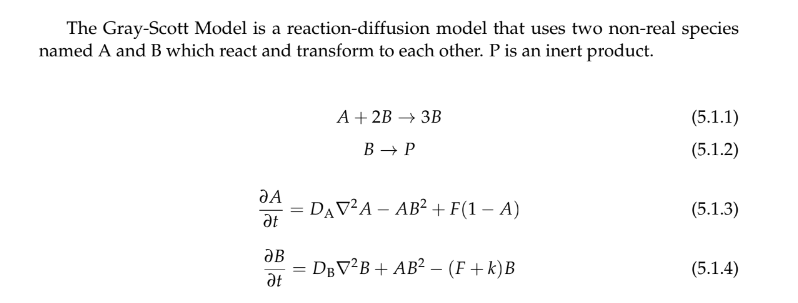
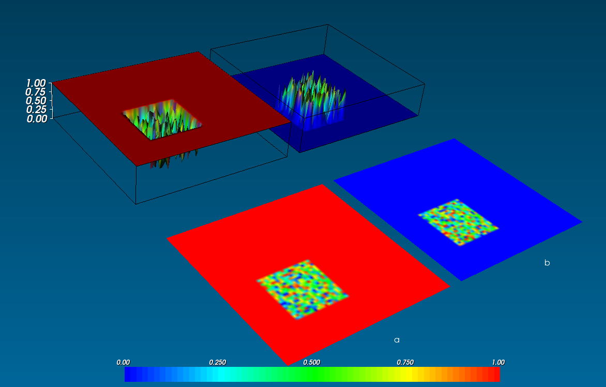

# BT5051 Transport Phenomena
# Choose-Focus-Analyse (CFA)

This repository will serve as a reference for the code used in the CFA (Choose-Focus-Analyse) report I made as a part of the course BT5051 (Transport Phenomena in Biological Systems) offered by Prof. G. K. Suraishkumar in the independence semester of 2020 during my undergraduate studies at IIT Madras.

I. 4 different cases of information diffusion have been studied in a 2D network in which the initial conditions and boundary conditions are different. In each case the boundary conditions are such that the initial sources of information remain as a constant source of information with maximum information density value of 100.  

Results of the simulations:

II. Information diffusion and interaction were modeled using the Gray-Scott Model (a reaction-diffusion system).
  

Suppose we took A as information that confirms a given bias and B as information that serves as bias, then this system could represent the dynamics of information diffusion and reaction that results in bias-forming information being constantly surrounded by bias-confirming evidence/information. This result is not far from cognitive biases in individuals or society at large where people preferentially consume information that confirms their inherent biases which may or may not have any truth.  

This is only one application of the model in information interaction. There is scope for many more applications, interpretations and modifications of the parameters being used, and the number of interacting species.  

Parameter values used:  
• DA = 0.082 units  
• DB = 0.041 units  
• k = 0.064 units  
• F = 0.035 units  
• Grid dimensions = 64x64x1  

Results of the simulation: (Click on the picture to view a video of the simulation)  

<a href="https://youtu.be/RtX9uDPRO7E"></img></a>
  
Software used for the above simulation:  
Tim Hutton, Robert Munafo, Andrew Trevorrow, Tom Rokicki, Dan Wills. "Ready, a cross-platform implementation of various reaction-diffusion systems." https://github.com/GollyGang/ready
